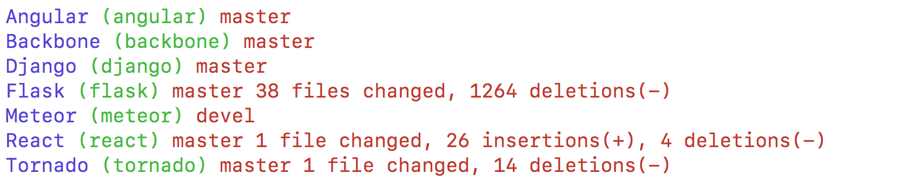
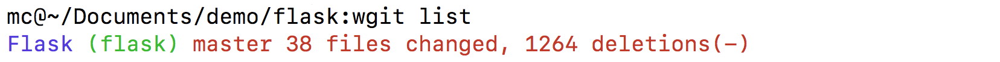
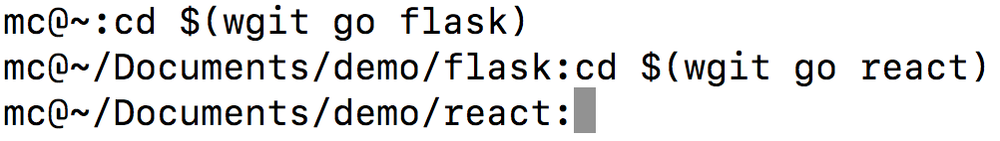

# wgit.py

Beautiful project manager living in your shell.  
Rewritten in beautiful language.

 

 

## Requirements

Requirements for installation

- python (https://www.python.org)
- pip (https://pip.pypa.io)
- virtualenv (https://virtualenv.pypa.io)

 

## Setup

Installation process

    git clone https://github.com/watchgit-com/wgit-py.git ~/.wgit
    cd ~/.wgit
    bash install.sh
    wgit init

 

## Add current directory to projects

Each project has it's alias and name.  
Alias is the console shortcut to project name.
    
    wgit add {alias} {name}

 

> Example usage:

 

## Remove current directory from projects

Keeping project list small and updated is vital.  
Greatly improves the readability and speed of output.

    wgit remove {alias}

 

> Example usage:

 

## List all projects

Iterating through all projects will list their name and alias.  
Current git branch and shortlist of changes.

    wgit list

 

> Example usage: 

 

## Go to directory of project

Jumping directly to project is what it is all about.  
End user just needs the fast and easy way to navigate.

    cd $(wgit go {alias})

 

> Example usage:

 

## License

MIT
